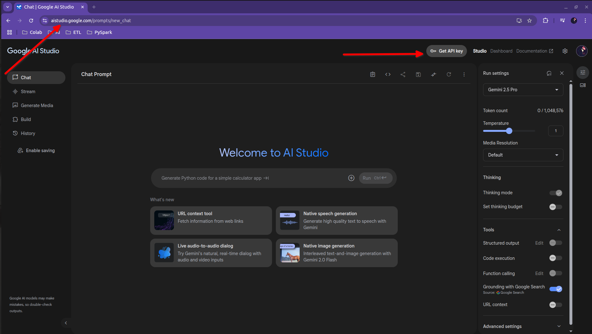
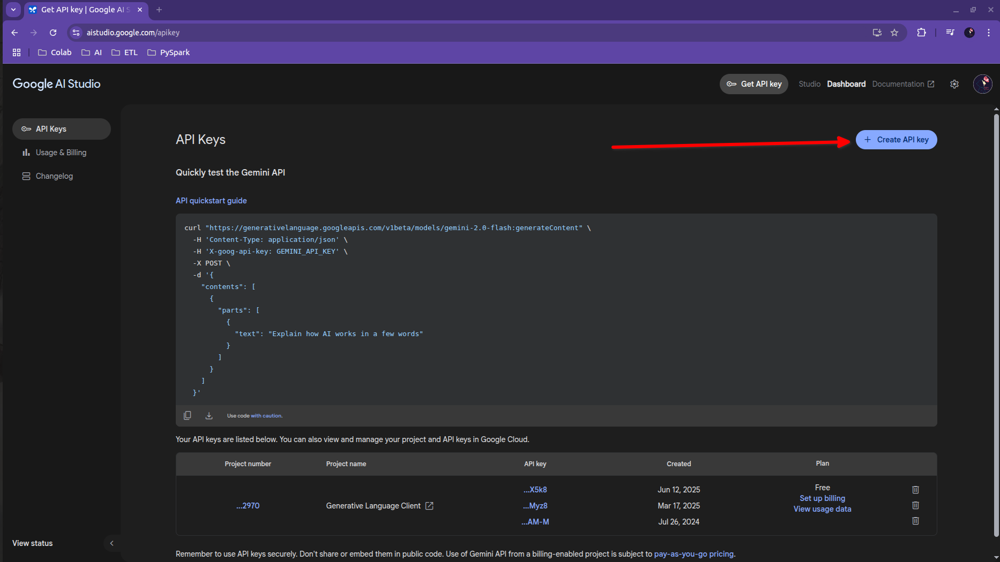
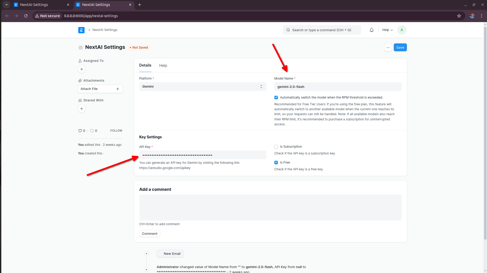
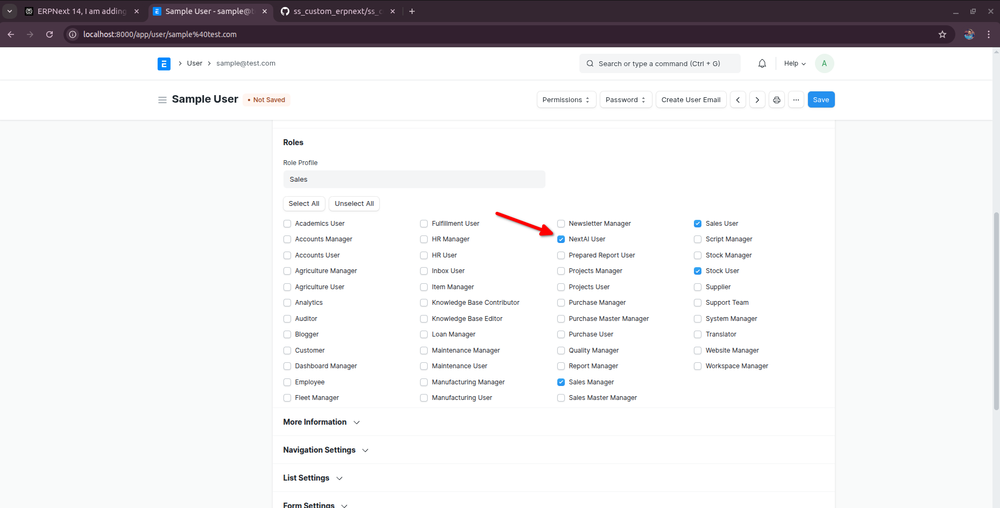
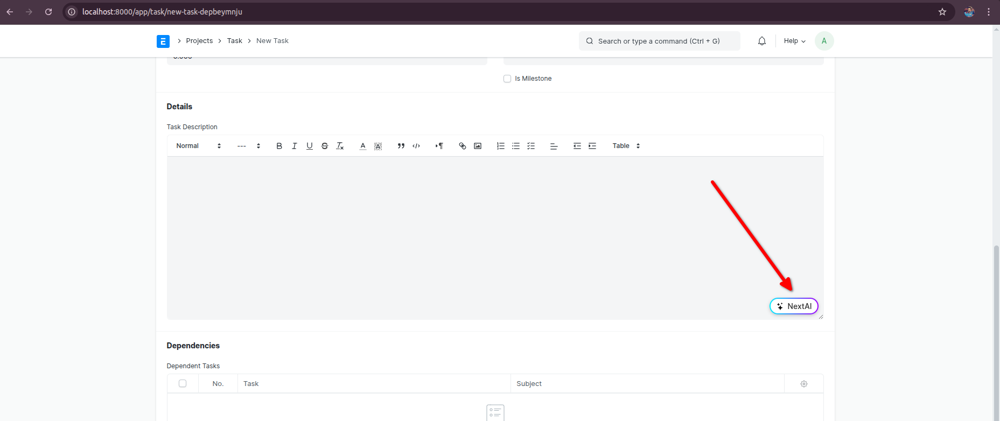

# **NextAI Setup Guide**

---

## [**How to Get the Gemini API Key**](https://www.erpnextai.in/video)

### **Step 1**
Go to [Google AI Studio (Gemini)](https://aistudio.google.com/) and click **Get API Key**.

### **Step 2**
After clicking **Get API Key**, you'll see the **Create API Key** option.  
Click it, and a prompt will appear with your API Key. **Copy this key**.

---

## **Integrating Gemini with NextAI**

Once you have the API Key, go to the **NextAI Setting** doctype:

- Paste the **API Key** into the **API Key** field.  
- If you have a premium subscription, check the Is Subscription checkbox; otherwise, leave it unchecked.
- Choose the model you created earlier from the dropdown.

--

## Using NextAI
Once you have completed the previous setup steps, follow these instructions to finish the integration and assign roles.

###### Assigning the NextAI User Role
- Go to the User doctype.
- Select the NextAI User role for the users who should have access to NextAI features.

###### Viewing the NextAI Icon
After assigning roles, you will notice a new icon in relevant fields, indicating that NextAI features are enabled.

This completes the process of enabling and configuring NextAI for your users. You are now ready to leverage NextAI's capabilities in your workflow.

